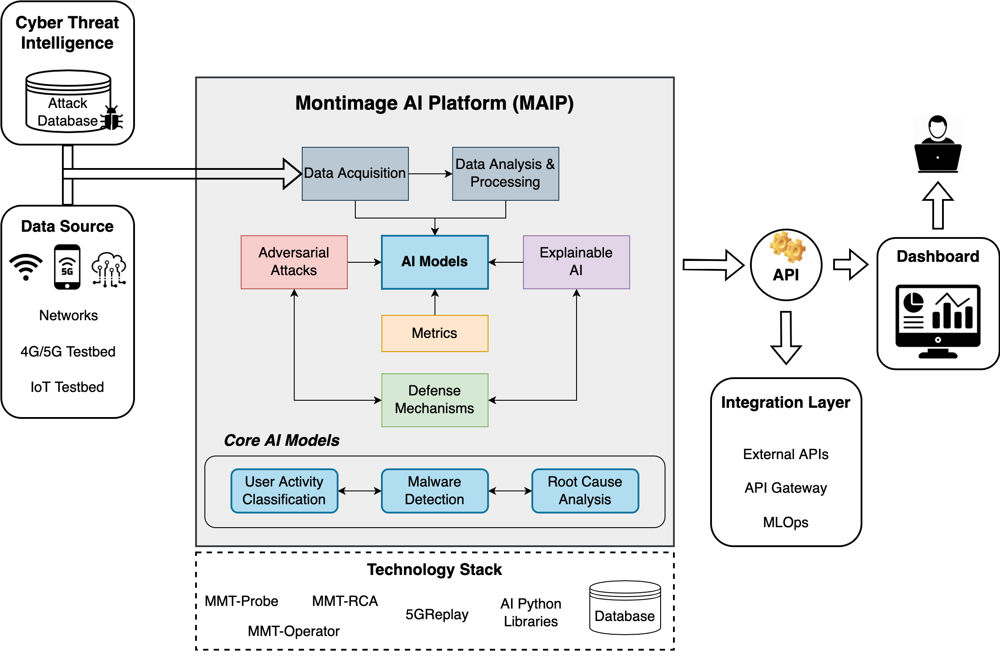

# maip
Montimage AI Platform (MAIP) provides users with easy access to AI services developed by Montimage, through a friendly and intuitive interface for interacting with the APIs. It provides a range of ML services, including extract features, build or retrain the model, inject adversarial attacks, produce explanations and evaluate our model using different metrics. Each of these services is exposed through dedicated **APIs** that can be accessed through the server, making it easy to integrate with other applications and systems.

The above figure shows the architecture of our MAIP framework, that includes the following main components:
- **Data acquisition** module collects raw traffic data from networks or IoT testbed in either online or offline mode. It can also use Cyber Threat Intelligence (CTI) sources, e.g., deployed honeypots, to learn and continuously train our model using attack patterns and past malware information in the database.
- **Data analysis \& processing** module employs our [Montimage monitoring tool (MMT)](https://github.com/Montimage/mmt-probe) to parse a wide range of network protocols (e.g., TCP, UDP, HTTP, and more than 700) and extract flow-based features. Then, the restructured and computed data is transformed into a numeric vector so that can be easily processed by our AI model.
- **AI models** module is responsible for creating and utilizing ML models able to classify the vectorized form of network traffic data for different purposes, such as user activity classification, malware detection in encrypted traffic or root cause analysis.
- **Adversarial attacks** module injects various evasion and poisoning adversarial attacks for robustness analysis of our system.
- **Explainable AI** module aim at producing post-hoc global and local explanations of predictions of our model.
- **Metrics** module allows to measure quantifiable metrics for its accountability and resilience.
- **Defense mechanisms** module provides countermeasures to prevent attacks against both AI and XAI models.

Overall our framework is designed with a server written in ExpressJS, that employs the MMT tool written in C for feature extraction and leverages popular Python libraries for DL and XAI. The client is built in React and accessible via Swagger APIs, offering users an intuitive and user-friendly interface to interact with the DL services.

Under construction documentation is available here: https://strongcourages-organization.gitbook.io/maip-documentation/

Video demo: https://drive.google.com/file/d/1Z1T8x1kYRMmW4O0OXPVhn9Por5ceAgDx/view?usp=sharing
